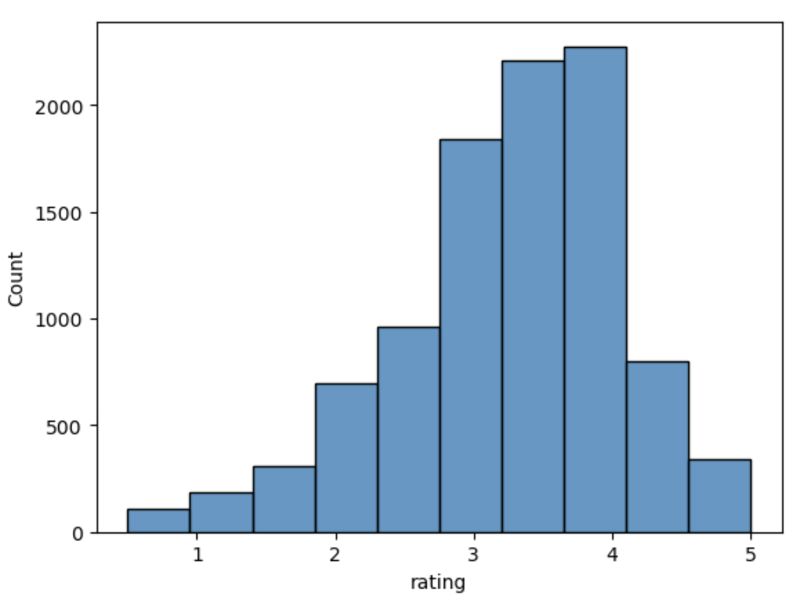
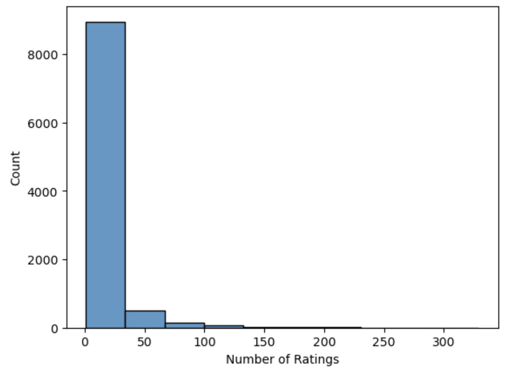
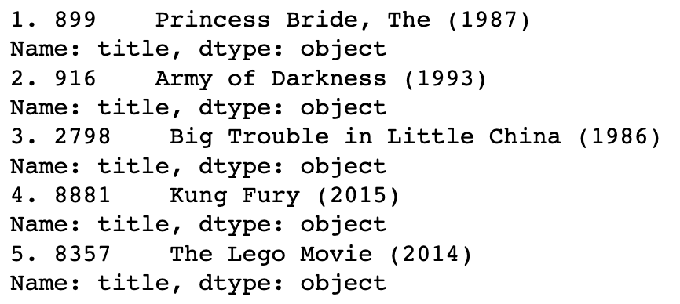

# Making Movie Recommendations

# Introduction

**Author**: Amelia Dobronyi  
**Pace**: Flex  
**Instructor**: Abhineet Kulkarni  

## Overview

This presentation introduces a system that recommends movies to users based on how he or she has rated previous films. This presentation reviews different approaches to such a system and the decisions that went into the final version.

## Business Problem

Use movie rating data to make informed movie recommendations for a given user. 

## Data

Approximately 100,000 user ratings on about 10,000 movies.

## Recommender Approaches

There are several different approaches that can be used to building a recommendation system: collaborative filtering, content filtering, or both. This system uses collaborative filtering and some content hybrid approach to deal with the cold start problem.

## Final Model

The final model uses an SVD calculation on user rating data (collaborative filtering) and allows the user to choose the genre(s) from which the recommendations should be selected. The final model achieved an in-sample RMSE of 0.55 (ratings are out of 5).

## Future Improvements

- Incorporate hybrid content filtering more broadly, using more of the information available about movies
- Try using similarities between movies rather than users in the similarity calculation

## Repository structure

- technical notebook: student_v1.ipynb
- figures folder
- data set: README.txt, links.csv, movies.csv, ratings.csv, tags.csv
- README.md
- presentation.pdf
- .gitignore
